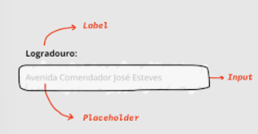
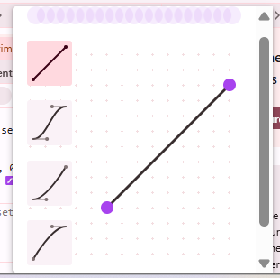
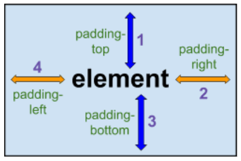
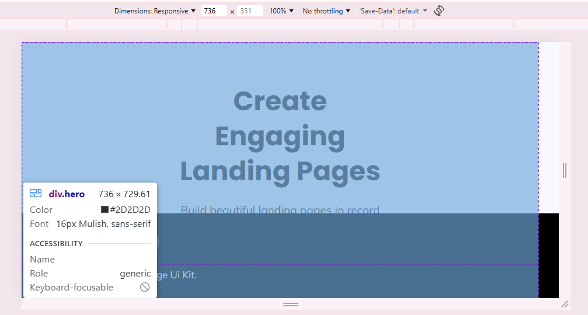

# setup
- importar o testDOIS ✅
- criar as cores ✅
- importar as google fonts ✅
- criar var sass p breakpoints, tem que ter um arquivo p isso ✅
- criar as tipografias de h1 ate h6 e body, pra isso funcionar tem que ter os breakpoints ✅
- criar um html com os h1s h6s e body provando que eles sao responsivos ✅
- criar componente de button, e ele tem uma variante dark ✅
- fazer um componente de imagem responsiva (ex do guanabara) ✅
- criar um html com uma imagem e provar que ela eh responsiva (ex do guana) ✅
- criar um html com grid provando que ela funciona ✅

# atomos

- icon (rede social dos cabecas) variante redonda pqna, variante tamanho de icone medio (our feature) e os grandes (features) (fazer a caixinha com border radious e a imagem), tem que ter variantes de tamanho e cor ✅

# moleculas

# componentes

- Meet our team ✅ 
- variantes do meet out team ✅

- our features / features ✅ 
- features small ✅
- features variable ✅

- list logos / variante ✅

- our metrics ✅
- variante our metrics ✅

- real stories cards ✅
- variantes real cards (nao precisa por o background ainda, so quando costurar, fazer so uma variante, so o background q muda) ✅

- card plans ✅

- refazer os buttons do primeiro layout! ✅

- get landing page botar so o telefone ali ✅
- fazer o responsivo ✅
- arrumar esse codigo como arrumei o creat engaging ✅

- creat engaging - so o cell ✅
- fazer o responsivo ✅

- header ✅

- creat engaging - todo o bloco ✅

- get landing page todo o bloco (do cell pequeno) call to action ✅

- arrumar coisas mencionadas na call com o bruno, margin nas coisas e mais algumas coisas. ✅

- fazer hover nos buttons ✅

- o ultimo banner (bruno disse que nao precisa fazer) ✅

- forms
- botao ✅
- icons ✅
- formulario ✅   
- media query ✅

- footer ✅

- fazer o bloco todo do features com os cards ✅

- arrumar o icon da rede social ✅

- fazer o bloco todo do our metrics ✅
- esse ta mais complicadinho entao vou deixar por ultimo pra add o texto ✅

- fazer os botoes do header ✅
- alinhamento do header ✅

- padding bottom nas coisas pra deixar bonitinho ✅

- footer  tem que ficar colado la no final da pagina 
- e se eu por ele como background como fiz com as flores no meu portifolio?

- social media icon do forms sumiu ✅

- refazer o main com as coisas novas ✅

- fazer o bloco todo do real stories ✅
- precisa resolver o alinhamento ✅

- fazer o bloco todo dos plans ✅
- precisa resolver o alinhamento ✅

- fazer o bloco todo do meet our team ✅
- precisa resolver o alinhamento ✅

# anotacao:

- por padding-bottom nas coisas, top nao eh necessario

- parar de usar -- p tablet e desktop e usar breakpoint agora.. nos proximos 

- lembrar que as imagens tbm tem que ter tamanho e altura, e tambem ter border radious caso ela seja redonda

- lembrar de por padding bottom nas coisas

- lembrar de commitar todos os dias

- vou adotar o camelcase nesse projeto

- na questao de img e medias eh bom usar aspect-ratio por conta de responsividade

- e se usa aspect-ratio em divs, com imagem dentro:

&-contentImage {
    aspect-ratio: 315/278;
    overflow: hidden;
    border-radius: 20px 20px 0 0;

    @media (min-width: bp.$tablet) {
        aspect-ratio: 213 / 173;
    }

    &-img {
        width: 100%;
        height: auto;
    }
}
- video sobre aspect ratio: https://www.youtube.com/watch?v=sanebW8YMbo

- nem sempre precisamos definir height pras coisas pq isso quebra tudo as vezes

- MARGIN: 0 AUTO: isso aqui alinha no meio sem precisar usar flex ou grid, mas precisa acompanhar um max-width ou display: block;

- testimonials: significa depoimentos em portugues. Real stories poderia ser substituido por testimonials e nao seria errado.

- Z-INDEX:
https://www.youtube.com/watch?v=vo1JBj-OAa8

https://www.w3schools.com/cssref/pr_pos_z-index.php

https://www.alura.com.br/artigos/z-index-utilizar-essa-propriedade-css

alura:
Quando pensamos em posicionamento de elementos, a primeira coisa que vem à nossa cabeça são os eixos X e Y - o eixo X é referente à coordenada horizontal e o eixo Y referente a coordenada vertical. Já o eixo Z é responsável pelo cálculo e posicionamento da profundidade de um determinado elemento em relação à tela, se estará mais afastado ou mais próximo.
E para que essa propriedade tenha efeito, o elemento precisa ter a propriedade position definida com o valor diferente de static, que é seu valor de posicionamento padrão. Ou seja, o elemento deve estar com sua position definida com fixed, sticky, relative ou absolute.

- POSITIONS:
https://www.w3schools.com/Css/css_positioning.asp

https://www.youtube.com/watch?v=YEmdHbQBCSQ

https://www.youtube.com/watch?v=zPlt84S1L0U

https://www.youtube.com/watch?v=0vDGIR1NFqM

- para mover coisas usando position, devemos usar top, bottom, left, right... nao eh certo usar margin ou padding por exemplo.

- relative: ocupa um espaco determinado
- absolute: ele fica sem tamanho definido, e se scrollar a tela ele eh absoluto a todos os outros.

- o nome do bem NAO precisa ser herediatario, exemplo:
- hero > hero__textContainer > hero__wrapper > hero__title 
- hero__cellContainer
- achei que era hereditario, mas tbm preciso lembrar do BLOCO! o hero nesse caso é o pai, o resto sao blocos e tbm pode ter o modifier --

- markdown: 
:cat:
https://markdownlivepreview.com/

- animations: 
https://www.w3schools.com/css/css3_animations.asp

https://developer.mozilla.org/en-US/docs/Web/CSS/Reference/Properties/animation

- FORM:

https://www.w3schools.com/html/html_forms.asp

https://developer.mozilla.org/pt-BR/docs/Learn_web_development/Extensions/Forms/Your_first_form

https://www.youtube.com/watch?v=hlwlM4a5rxg

- label x placeholder:

- tipos de animacao(no devtools):

- BUTTON / <A>: 
- No HTML, o <a> (âncora) é usado para navegação: leva o usuário para outro lugar, como outra página, uma seção da mesma página, um arquivo ou um link externo (ex.: site, WhatsApp, e-mail com mailto:).
Já o <button> é usado para executar uma ação, como enviar um formulário (submit), cancelar (reset) ou disparar uma função em JavaScript.

- SHORTHAND: 
- 
- regra: sentido horario
- TOP, RIGHT, BOTTOM, LEFT.

- COMO COLAR O FOOTER NO FIM DA PAGINA? 
- consegui achar a resposta na alura, depois de quebrar a cabeca com um montao de outras maneiras e pra surpresa de 0 pessoas nao ter funcionado de primeira.

- resposta:
- position: fixed;
- bottom: 0;
- acompanhando o width 100% pra ocupar toda a largura.

- existem algumas mudancas no design que nao fazem mt sentido, a cin me disse que esse tipo de coisa especifica nao precisa mudar pq deve ser erro de design mesmo.

- apaguei o features variable!

- arrumar o alinhamento dos textos com os cards 
- solucao: 
- envolver tudo em uma divzona nova, o texto e os cards separados, alinhar tudo e o tamanho do texto se muda no p ou no h2, e nao na div pai.. assim da errado!

# to do :

- arrumar os outros projetos, fazer ele ser responsivo, e nao fazer eles separadinhos ✅

- arrumar o padrao no nome das pastas que eu to fznd no storypobre ✅

TODO Por o projeto no vercel pra facilitar acesso dos mentores

- buttons sao um A e tem que ter o cursor pointer ✅

- fazer um storypobre com todos os componentes que eu fiz ✅

- arrumar o endereco das imagens dos componentes ✅

- arrumar a pasta das imagens e por a img dentro de assets ✅

- TODO arrumar o main html com os componentes todos pra ver se ta dando certo!!

# duvidas:

- a partir dessa resolucao o layout quebra e n centraliza mais...

